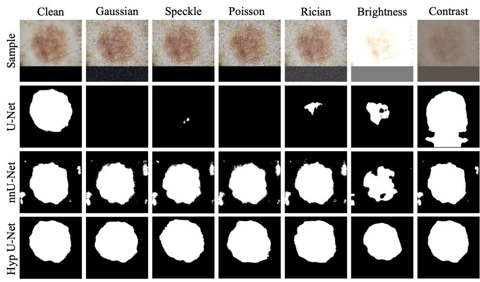

# Hyperbolic U-Net

This is the official implementation of the paper **"Hyperbolic U-Net for Robust Medical Image Segmentation"** accepted to **MIDL 2026** ([link](https://openreview.net/forum?id=NxKaeTNMxR#discussion)). A PyTorch implementation of Hyperbolic U-Net architectures for robust medical image segmentation. This repository contains both Euclidean and Hyperbolic variants of U-Net models, including support for flexible curvature settings and various loss functions optimized for medical image analysis.



## Overview

This project implements state-of-the-art U-Net models for medical image segmentation with the following features:

- **Euclidean U-Net**: Traditional Euclidean space U-Net architecture
- **Hyperbolic U-Net**: Hyperbolic geometry-based U-Net for improved robustness
- **Flexible Architectures**: Support for nested U-Net variants
- **Multiple Loss Functions**: Dice, Tversky, Focal, Cross-Entropy, and combinations thereof
- **Riemannian Optimization**: Support for Riemannian Adam and SGD optimizers for hyperbolic models
- **Multi-Dataset Support**: Built-in support for ISIC, REFUGE2, CVC-ColonDB, and other medical imaging datasets
- **Experiment Tracking**: Integration with Weights & Biases (W&B) for experiment monitoring

## Requirements

### System Requirements
- Python 3.8+
- CUDA 11.0+ (for GPU support)
- Conda (recommended for environment management)

### Key Dependencies
- PyTorch 2.0+
- torchvision
- albumentations (data augmentation)
- nibabel (NIfTI format support)
- scikit-image
- medpy (medical image metrics)
- wandb (experiment tracking)
- hypll (Hyperbolic Learning Library)

## Installation

### Using environment.yml (Recommended)

The repository includes an `environment.yml` file with all dependencies pre-configured:

```bash
conda env create -f environment.yml
conda activate hypunet
```

<details><summary>Fallback: Manual Installation</summary>

If the `environment.yml` file fails, you can set up the environment manually:

#### Step 1: Create Conda Environment

```bash
conda create -n hypunet python=3.10
conda activate hypunet
```

#### Step 2: Install PyTorch

Choose the appropriate command based on your system:

**For CUDA 12.1 (Recommended):**
```bash
conda install pytorch torchvision torchaudio pytorch-cuda=12.1 -c pytorch -c nvidia
```

**For CUDA 11.8:**
```bash
conda install pytorch torchvision torchaudio pytorch-cuda=11.8 -c pytorch -c nvidia
```

**For CPU-only:**
```bash
conda install pytorch torchvision torchaudio cpuonly -c pytorch
```

#### Step 3: Install Key Dependencies

```bash
pip install torch==2.4.0 torchvision==0.19.0 wandb==0.13.5 albumentations==2.0.0 nibabel==5.3.2 scikit-image==0.25.2 medpy==0.5.2 hypll==0.1.1 pandas numpy scipy tqdm
```

</details>


## Data Preparation

The repository supports multiple medical imaging datasets with automatic dataloader configuration. Please download them from the following links:

### Supported Datasets
- [**ISIC** / **ISIC18**](https://challenge.isic-archive.com/data/) : Skin lesion segmentation 
- [**REFUGE2**](https://www.kaggle.com/datasets/victorlemosml/refuge2) : Optic disc/cup segmentation
- [**CVC-ColonDB**](http://vi.cvc.uab.es/colon-qa/cvccolondb/): Polyp segmentation
- [**BUSI**](https://www.sciencedirect.com/science/article/pii/S2352340919312181): Breast Ultrasound Images
- [**KVASIR**](https://datasets.simula.no/kvasir-seg/): Gastrointestinal polyp dataset
- [**SANET**](https://github.com/weijun-arc/SANet): Polyp segmentation
- **nnU-Net Format**: Any dataset in nnU-Net format with `imagesTr/labelsTr` and `imagesTs/labelsTs` directories

### Dataset Structure Example

The `MakeDataset` class automatically handles various dataset formats. To verify the dataset formats check the [make_dataset.py](dataloading/make_dataset.py) file. Please ensure that the `img_suffix` and `mask_suffix` for the input image names and target masks names respectively are entered correctly. We have given the example of ISIC16 dataset below:

Example dataset structure for ISIC16:

```
ISIC/
├── ISBI2016_ISIC_Part1_Training_Data/                  # Training/input images
├── ISBI2016_ISIC_Part1_Training_GroundTruth/           # Training/target masks
├── ISBI2016_ISIC_Part1_Test_Data/                      # Test images
└── ISBI2016_ISIC_Part1_Test_GroundTruth/               # Test masks
```

## Training

### Example: Training Hyperbolic U-Net

```bash
python train.py \
  --project medical_seg \
  --dataset ./datasets/ISIC \
  --model hyp \
  --channels 3 \
  --classes 2 \
  --init_feats 8 \
  --depth 4 \
  --optim adam \
  --loss dice+focal \
  --epochs 30 \
  --batch-size 8 \
  --learning-rate 1e-3 \
  --scale 1.0 \
  --curvature 0.1 \
  --validation 10 \
  --trainable
```

### Example: Training Standard U-Net

```bash
python train.py \
  --project medical_seg \
  --dataset ./datasets/REFUGE2 \
  --model euc \
  --channels 3 \
  --classes 2 \
  --optim adam \
  --loss tversky+focal \
  --alpha 0.3 \
  --beta 0.7 \
  --epochs 50 \
  --batch-size 8 \
  --learning-rate 1e-3 \
  --scale 1.0 \
  --validation 10 \
  --amp
```
## Output

Model weights are saved in:
```
./checkpoints/<dataset_name>/<model_name>
```

## Evaluation and Testing

### Testing Script

The `test.py` script provides comprehensive evaluation with various metrics:

```bash
python test.py \
  --dataset ./datasets/ISIC \
  --load <path_to_checkpoint> \
  --model <model_type> \
  --channels 3 \
  --classes 2 \
  --init_feats 8 \
  --depth 4 \
  --batch-size 8 \
  --scale 1.0 \
  --curvature 0.1
  --experiment_name <name_of_experiment>
  [additional arguments]
```

### Evaluation Metrics

The framework automatically computes:
- **Dice Score**
- **IoU (Intersection over Union)**
- **Sensitivity (Recall)**
- **Specificity**
- **Hausdorff Distance**
- **Hausdorff Distance 95**

The evaluation results are saved under the directory `<name_of_experiment>`

## Model Architectures

### Euclidean U-Net (`euc`)
Standard U-Net architecture operating in Euclidean space.

### Hyperbolic U-Net (`hyp`)
U-Net operating in hyperbolic space (Poincaré ball model).

### U-Net++ and Hyperbolic U-Net++ (`nestedunet`, `hnestedunet`)
Euclidean and Hyperbolic variants of U-Net++

## Loss Functions

Available loss combinations for different segmentation tasks:

- **Dice + Cross-Entropy** (`dice+CE`): Balanced for general segmentation
- **Dice + Focal** (`dice+focal`): Better for class imbalance
- **Tversky + Cross-Entropy** (`tversky+CE`): Customizable false positive/negative trade-off
- **Tversky + Focal** (`tversky+focal`): Combines Tversky and focal strengths

### Loss Parameters
- **alpha**: Weight for false positives (typically 0.2-0.3 for small objects)
- **beta**: Weight for false negatives (typically 0.7-0.8 for small objects)
- **gamma**: Focus strength for focal loss (typically 1.33-2.0)

## Experiment Tracking

This project integrates with **Weights & Biases** (W&B) for experiment tracking:

1. **Initialize W&B** (one-time setup):
```bash
wandb login
```
2. **Automatic Logging**: All training metrics, configurations, and checkpoints are logged to W&B
3. **Monitor**: View real-time training progress at https://wandb.ai/

## GPU Memory Management

If you encounter out-of-memory errors:

1. **Reduce batch size**: `--batch-size 1`
2. **Enable gradient checkpointing**: Automatically activated on OOM errors
3. **Reduce image scale**: `--scale 0.25`

## Citation

If you use this code in your research, please cite:

```bibtex
@software{hyperbolic_unet_2025,
  author = {Mishra, Swasti Shreya},
  title = {Hyperbolic U-Net for Medical Image Segmentation},
  year = {2025},
  url = {https://github.com/yourusername/Hyperbolic-U-Net}
}
```

## License

This project is licensed under the MIT License - see the [LICENSE](LICENSE) file for details.

## References

- U-net: Convolutional networks for biomedical image segmentation (Ronneberger et al., 2015)
- Unet++: Redesigning skip connections to exploit multiscale features in image segmentation (Zhou et al., 2019)
- Hyperbolic Learning Library: https://github.com/maxvanspengler/hyperbolic_learning_library

---

For questions or issues, please open a GitHub issue or contact the maintainers.
